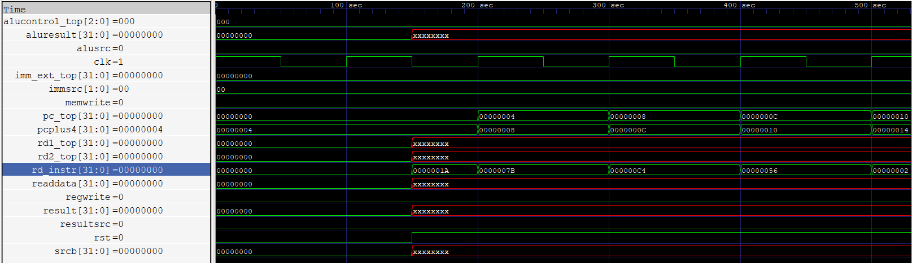

# Single Cycle MIPS CPU

Single-cycle MIPS processor is a simplified design where all instruction stages (fetch, decode, register read, ALU operation, memory access, write back) are completed in one clock cycle.


The memory address has been provided in the ```memfile.hex``` and can be visible in the ```rd_instr``` of the timing diagram.


## Deployment

To deploy this project clone this github repository and extract the files to VS Code. 

If you wish to simulate the timing diagram of single cycle cpu, enter 
```
iverilog -o sim .\single_cycle_cpu_testbench.v
```
A simulation output of sim is created as the output file . To generate the timing diagram of sim , enter 
```
vvp sim
```

If we wish to simulate single cycle cpu, then following command is given
```
gtkwave .\single_cycle_cpu_waveform.vcd
```
A timing diagram will be generated by GTKwave Analyser. We can analyse the output signals as per our requirement. 



